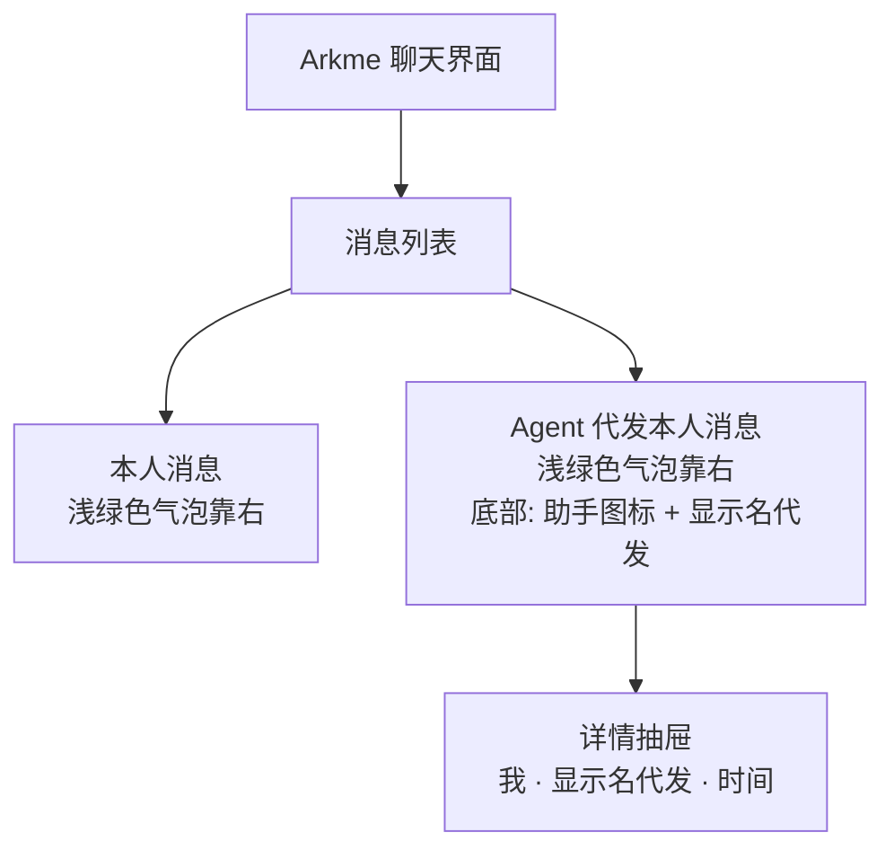
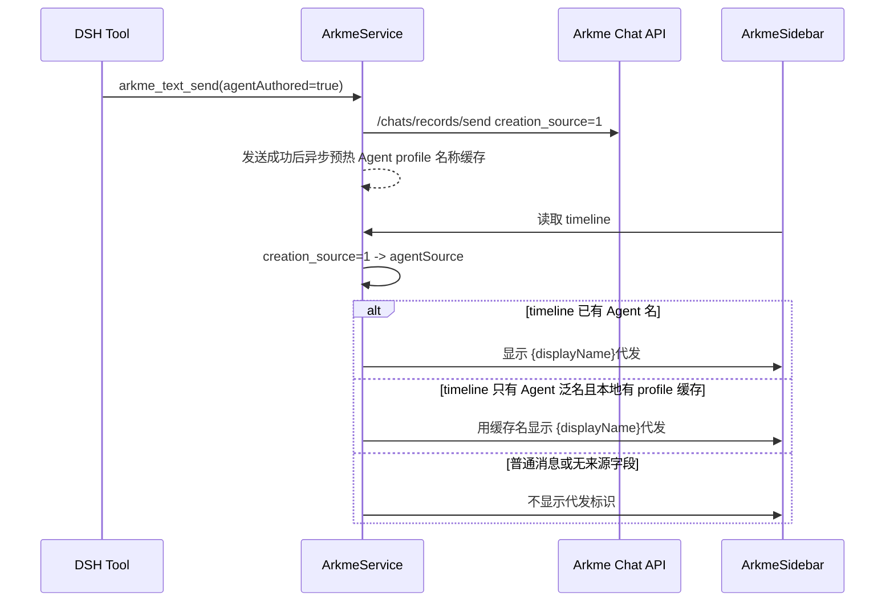

# Agent Proxy Sender Display Flow

## UI 图

## 交互图

## 边界

- 普通手动发送不携带 `agentAuthored`，不会写 `creation_source=1`。
- 工具发送不在发送前同步查询 profile / preset，避免代发标识引入发送延迟。
- DSH Web 只消费 timeline 的来源字段和已缓存的 Arkme Agent profile 名，不新增本地消息来源表。
- Flutter 客户端口径：`creation_source=1` 表示 Agent 代发，文案为 `{displayName}代发`。
