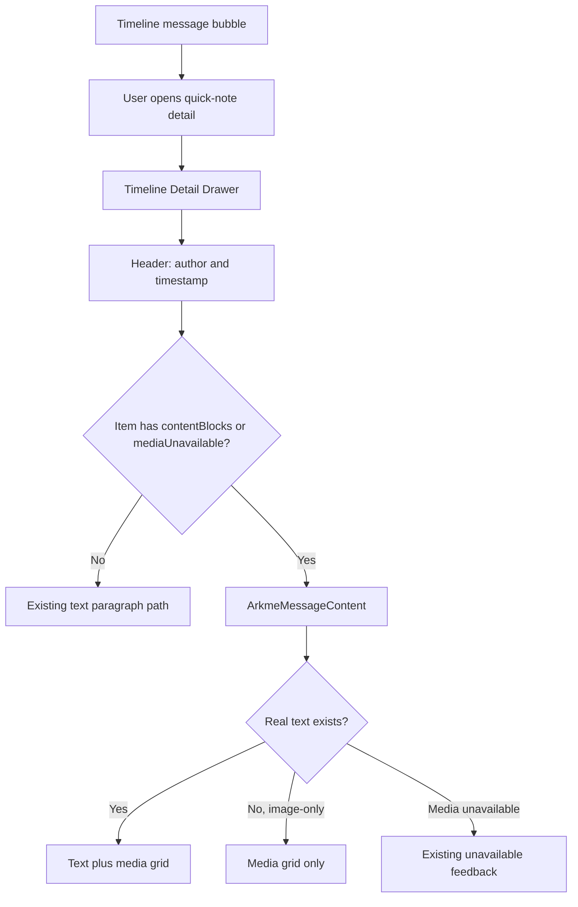
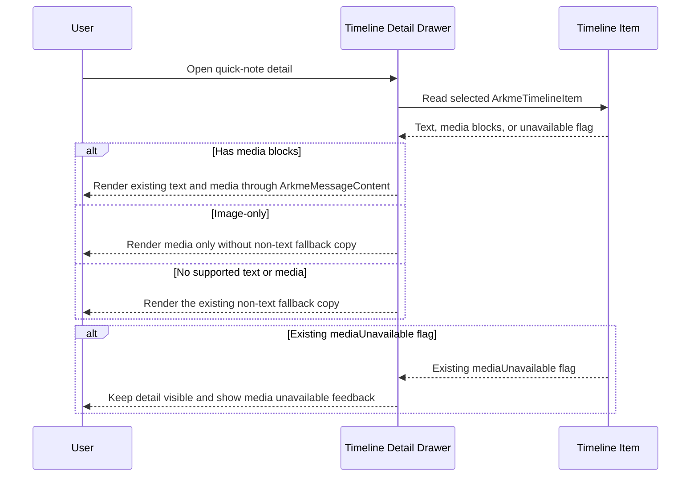

# Quick Note Detail Images

## Scope

This change completes ordinary timeline quick-note detail rendering for records that already contain image media blocks. It only changes the Arkme plugin UI projection and reuses the existing message media renderer. It does not change Flutter, DSH, backend APIs, Host routes, Tools, SDK contracts, or media hydration.

## UI Diagram

## Interaction Diagram

## Validation Notes

- Existing text-only quick-note details keep the old paragraph rendering path.
- Image details use `ArkmeMessageContent` so media URLs continue to flow through the existing local media proxy instead of exposing signed OSS URLs.
- Image-only timeline details render the media grid without the `非文本内容` fallback label.
- If media hydration is unavailable, the detail remains readable and the media area shows the existing unavailable feedback.
