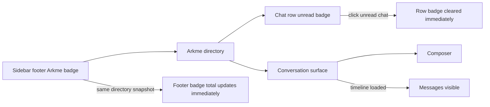
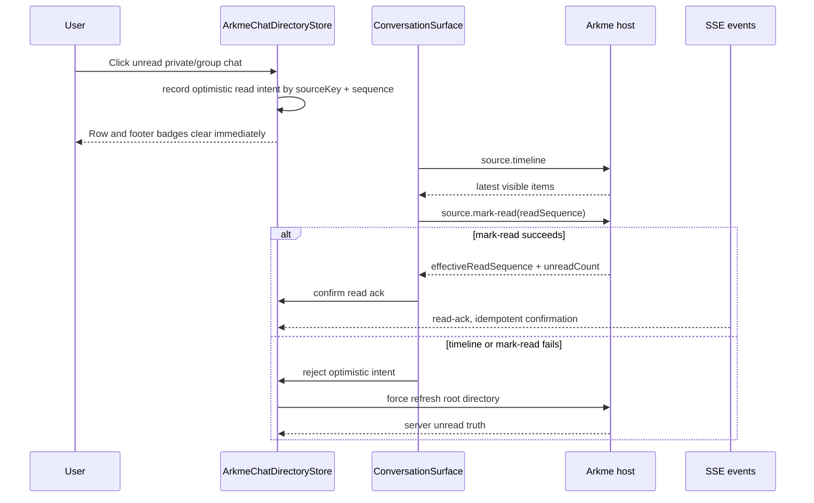

# Arkme Read Ack Optimistic Flow

## UI 图

## 交互图

## 关键规则

- 本地乐观清零只用于 private/group chat，且必须有有效 `latestSequence`。
- 旧投影的 `latestSequence <= readSequence` 时不能把红点顶回来。
- 新消息的 `latestSequence > readSequence` 时必须允许红点重新出现。
- 服务端确认会收敛本地 optimistic intent；失败会撤销并强制刷新目录。
