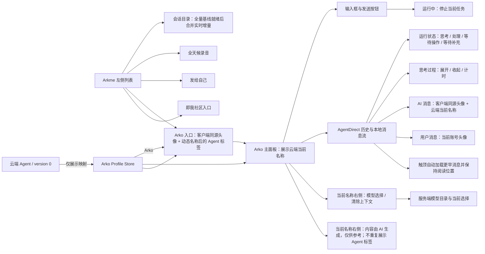
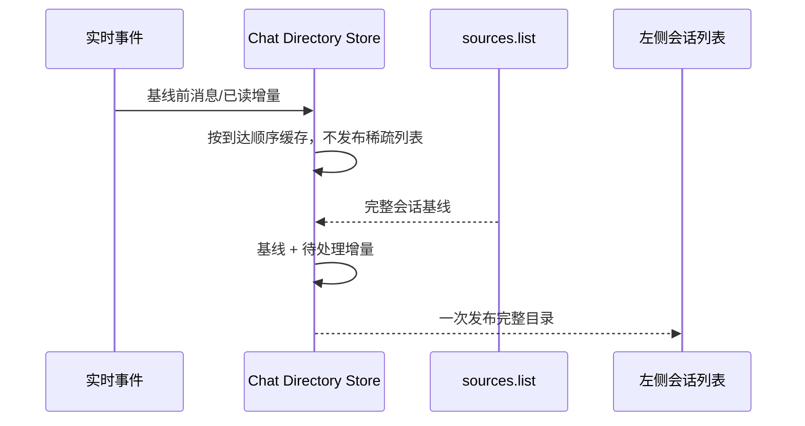
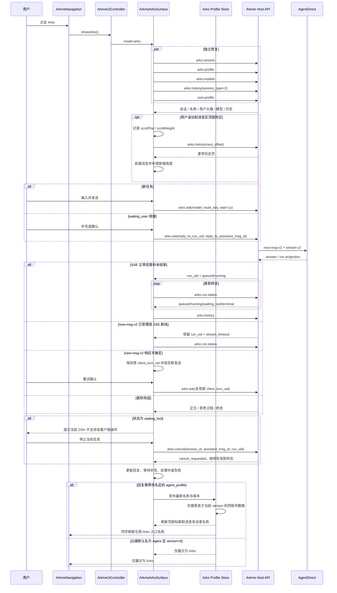
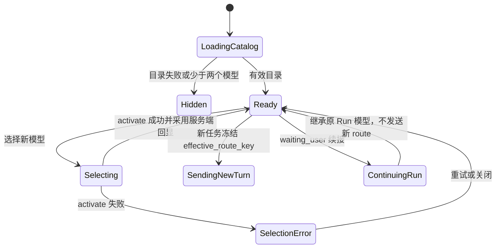
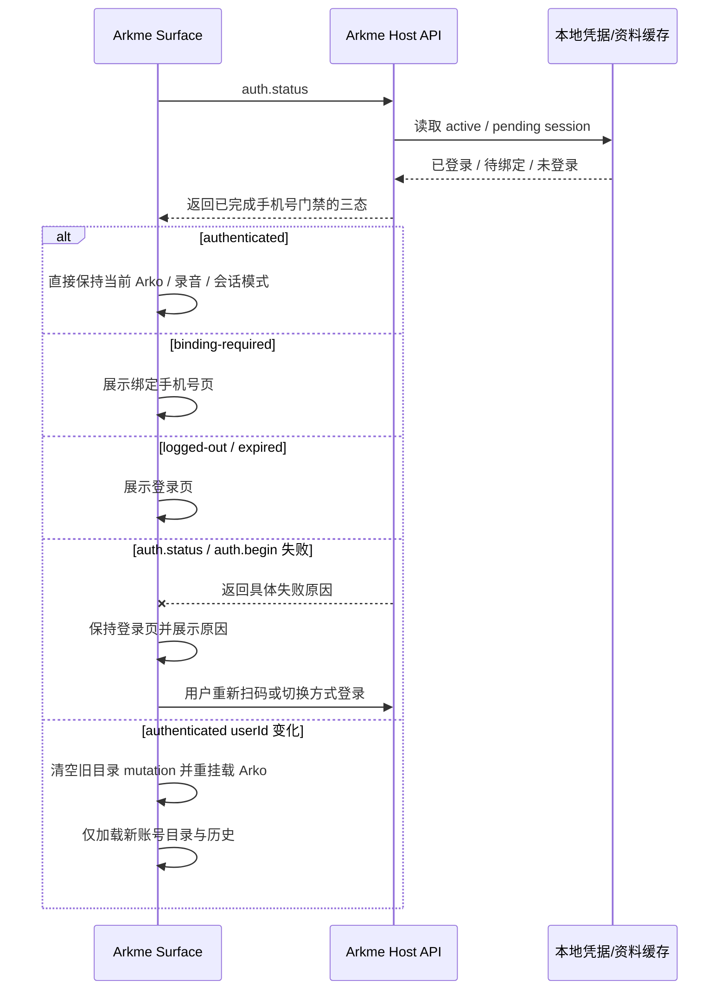

# Arkme Arko 入口实现说明

## OpenSpec 一致性判断

- 本次改变 Arkme DSH 插件内的前端入口和交互支线：左侧会话列表新增 Arko 固定入口，主面板新增 Arko 对话模式。
- 不改变服务端接口契约，不新增跨仓字段语义；Arko 调用仍复用插件已有 AgentDirect 能力。
- 本次修复改变任务失败恢复、待确认发送和 Tool 结果回收分支，已在根仓新增 `c20260819-dsh-arko-run-recovery` OpenSpec change；本文件保留插件实现级图示。

## UI 图

### 会话目录初始化交互

## 交互图

## 模型选择交互图

## 状态与失败恢复

- 会话是唯一阻断项：`arko.session` 失败时禁用输入并展示错误。
- Profile 和模型目录是独立增强项：读取失败时名称回退为 `Arko`、模型回退服务端默认。历史失败必须显示独立错误与重载入口，不能显示为“暂无对话记录”。
- 新任务携带模型目录的 `effective_route_key`；目录无效时省略字段，由服务端回退默认模型。
- `waiting_user` 后的下一条输入必须携带原 `run_uid + assistant_msg_id`，且不得发送新模型路由。
- 清除上下文通过新建 `type=2` 会话实现，保留历史消息并切断旧 Run 的续接关系。
- 模型选择、发送、清除上下文和历史翻页分别防重入，并为失败保留可重试入口。
- 历史翻页与私聊/群聊一致：顶部哨兵进入 120px 预加载区后自动请求更早消息，前插完成后按新增高度补偿 `scrollTop`；加载失败停止自动重试并提供原页重试。
- Arko 主面板不重复展示 Agent 资料头；模型选择和清除上下文位于当前 Arko 名称右侧。
- 用户消息头像读取当前账号的安全头像引用；AI 消息头像复用客户端 AgentDirect 头像，发送者名称只展示云端当前名称，不追加 `AI` 文案。
- Arko profile 是侧边栏入口与主面板共享的前端状态；改名回执会同时刷新两处。仅云端 `Agent/version=0` 默认投影映射为 `Arko`，用户主动保存的 `Agent/version>0` 保持原样。
- 新发送和重进页面发现的 active Run 都由同一轮询链恢复；只恢复当前会话最新 Run。首次查询前保留 1.2 秒状态投影窗口，前两次失败保持“正在处理”，连续三次失败后才展示同步异常，并以最高 10 秒退避继续重连。
- 只有首次历史恢复、新发送、任务终态刷新和清除上下文会滚动到底部；加载更早消息不得触发全局滚底副作用。
- `new-msg-v2` 成功后即视为任务已受理；后续 SSE 断线不得回报“发送失败”，必须保留 Run 身份并转状态轮询，避免用户重试造成重复业务操作。
- `new-msg-v2` 响应不确定时在当前标签页保存 pending turn；重试确认必须复用原 `client_turn_uid`，未完成对账前禁止新发送和清除上下文。
- Tool 状态查询进入终态后使用 `surface_assistant_msg_id` 从现有历史分页回收最终正文，不修改系统提示词或服务端契约。
- `waiting_tool` 保持运行锁，但必须展示“不支持的客户端操作”说明和停止按钮；停止请求继续轮询到权威终态。
- Profile Store 以账号和云端 `version` 为一致性边界：跨账号快照不展示，同账号低版本或同版本迟到响应不覆盖当前名称。

## 登录态初始化图

- `auth.status` 不在每次组件挂载时重复访问远端；active session 有资料缓存时直接返回，旧凭据首次无缓存时仍执行一次迁移校验。
- Host 返回的 `authenticated` 已完成手机号绑定校验；前端不得在重挂载时再用 `user.profile.refresh` 创建第二套门禁。
- 用户界面只展示登录、绑定手机号和已登录内容，不展示“正在确认登录状态”或认证重试页。
- 登录请求失败仍属于登录页：直接显示 Host 原因，二维码区域可重新发起扫码，手机号和测试账号入口保持可切换。
- 已认证 `userId` 变化时，目录 Store 切换 generation 并清空旧 mutation，Arko Surface 使用账号 key 重挂载，防止旧账号历史短暂残留。
