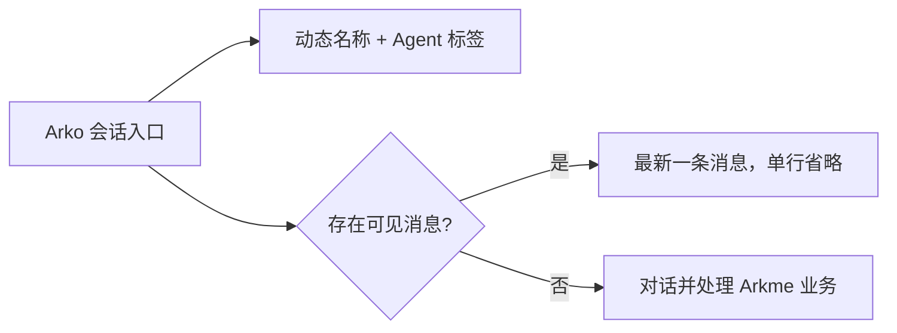
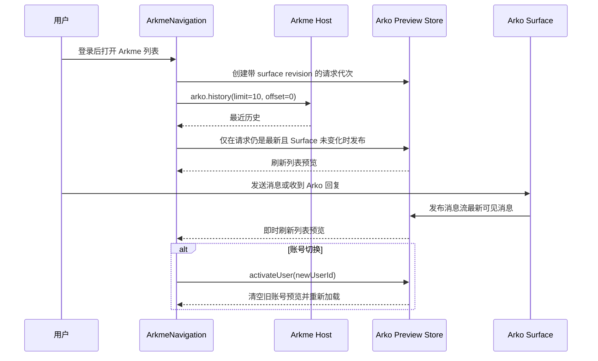

# Arko 会话列表最新消息预览

## OpenSpec 一致性判断

- 本次只把已有 `arko.history` 与当前 Arko 消息流投影到左侧固定入口，不改变业务主线、失败恢复、接口字段语义或仓库范围。
- 不新增服务端请求契约；无历史时保留原产品描述。因此本次无需更新 OpenSpec 文档。

## UI 图

## 交互图

## 状态与边界

- 历史读取失败不阻断列表，继续显示原产品描述或当前会话已发布的预览。
- 空白中的 assistant 处理占位不覆盖上一条可见用户消息。
- 多行消息折叠为空格，列表继续使用既有单行省略样式。
- 同秒历史使用数字 `messageId` 决定先后，不使用字符串排序。
- Surface 以页面实际展示顺序发布，避免本地毫秒时间与服务端秒级时间互相比较。
- 每次重新打开 Arkme 列表都会刷新历史；迟到请求和 Surface 发消息后的旧响应都不能覆盖新预览。
- Store 以 `userId` 隔离，账号切换立即清空旧预览。
