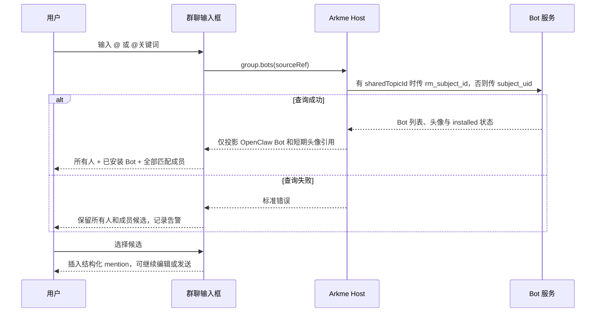

# 群聊 @ 候选 UI 与交互说明

## UI 图

```text
┌──────────────────────────────┐
│ 所有人                        │
│ Bot头像 已安装的 OpenClaw Bot │
│ Bot头像 另一个已安装的 Bot    │
│ 头像 群内昵称（联系人备注）      │
│ 头像 群内昵称                  │
│ ……全部匹配成员（列表内滚动）…… │
└──────────────────────────────┘
┌──────────────────────────────┐
│ @                            │
│ ＋                       发送 │
└──────────────────────────────┘

加载中：先展示已经取得的成员候选，Bot 返回后原位补入。
长列表：不截断 Host 返回的匹配成员，由固定高度的候选弹层滚动承载。
名称规则：候选行使用“群内昵称（联系人备注）”，无备注时只显示群内昵称；选中后在输入框中插入结构化 `@`。
头像规则：Bot 优先展示 `group.bots` 返回的真实头像；Host 只向 UI 投影账号绑定的短期图片引用，不暴露原始头像地址；无头像时回退到与 Flutter 一致的中性机器人图标。
空状态：没有匹配项时展示“暂无可 @ 的对象”。
失败状态：Bot 查询失败时保留所有人和成员候选，不阻断普通消息发送。
```

## 交互图



Bot 查询不创建新的页面状态机，也不改变消息发送契约；它只是群聊候选列表的一项可降级数据源。

## 能力覆盖矩阵

| 能力面 | 本次覆盖 | 说明 |
| --- | --- | --- |
| UI | 真人、所有人、群 Bot、私聊 Bot mention | 候选与输入框只保存不透明 `memberRef` / `botRef`，发送前由 Host 重新校验。 |
| SDK | `humanMentions`、`botMentions`、兼容 `botRefs` | 仓外插件可以使用与 UI 相同的结构化发送契约。 |
| Tools | 保留既有群 Bot `bot_refs` | 按当前产品范围不让 Agent 主动 mention 真人或所有人；旧入口不是残留代码，继续用于兼容已有 Tool 调用。 |
| Host owner | `ChatService` 发送，`BotService` 校验 Bot | mention 元数据只由 Host 生成；浏览器、Tool 和 SDK 都不能提交用户 ID、Bot ID 或上游响应。 |

UI 与 SDK 使用结构化 mention 区间；Tool 的 `bot_refs` 会由 Host 生成可见前缀。两者形态不同，但最终都由同一个发送 owner 生成、校验 `mention_metadata`。
